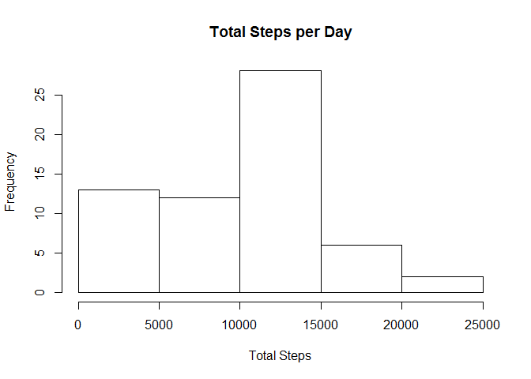
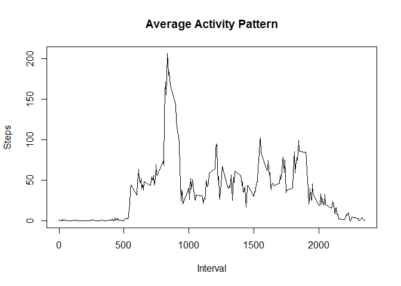
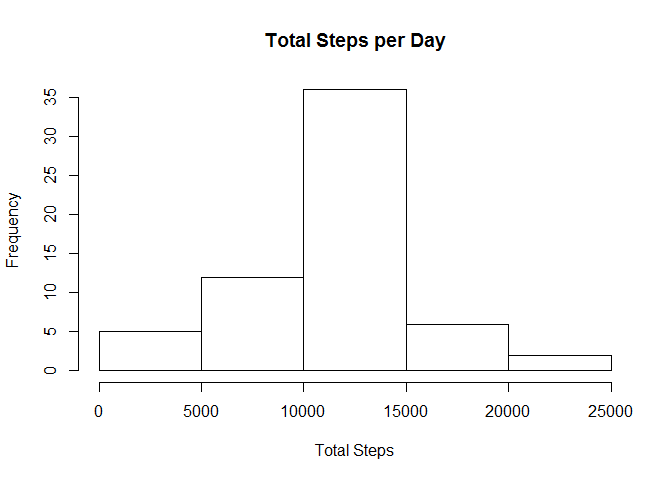

# Reproducible Research: Peer Assessment 1


## Loading and preprocessing the data
The following code loads the dplyr library and sets the locale to English.

```r
library(dplyr, quietly = TRUE, warn.conflicts = FALSE)
```

```
## Warning: package 'dplyr' was built under R version 3.1.3
```

```r
Sys.setlocale("LC_TIME", "English")
```

```
## [1] "English_United States.1252"
```

To read the .CSV data inside the ZIP file, the following code is run:

```r
data <- read.csv(unz("activity.zip", "activity.csv"), header = TRUE, sep = ',')
data$date <- as.Date(data$date)
```


## What is mean total number of steps taken per day?

The total number of steps taken per day is calculated as follows:

```r
total <- data %>% group_by(date) %>% summarize(sum(steps, na.rm = TRUE))
names(total) <- c("Date", "Steps")
```

The histogram of the total number of steps taken per day is:

```r
hist(total$Steps, main = "Total Steps per Day", xlab = "Total Steps")
```

 

The mean total number of steps taken per day is:

```r
mean(total$Steps)
```

```
## [1] 9354.23
```

The median total number of steps taken per day is:

```r
median(total$Steps)
```

```
## [1] 10395
```


## What is the average daily activity pattern?
The average total number of steps taken per day is calculated as follows:

```r
mean <- data %>% group_by(interval) %>% summarize(mean(steps, na.rm = TRUE))
names(mean) <- c("Interval", "Average")
```

The following plot shows the average daily activity pattern:

```r
plot(
  mean$Interval, 
  mean$Average, 
  type = "l", 
  main = "Average Activity Pattern",
  xlab = "Interval",
  ylab = "Steps"
)
```

 

The interval where it is taken the maximum average number of steps is obtained as follows:

```r
mean$Interval[mean$Average == max(mean$Average)]
```

```
## [1] 835
```


## Imputing missing values
The following code obtain the rows wher there is NA in the data. The number of NA inside data is as follows:

```r
na.rows = is.na(data$steps)
length(na.rows)
```

```
## [1] 17568
```


To substitute the NA data, the strategy was to input the mean value for that interval. The following code shows this stratety implemented.

```r
data.no.na <- data
for (r in 1:nrow(data))
  if (is.na(data$steps[r]))
    data.no.na$steps[r] <- mean$Average[mean$Interval == data$interval[r]]
```


The histogram of the total number of steps taken per day, for the data with no missing values, is:

```r
total.no.na <- data.no.na %>% group_by(date) %>% summarize(sum(steps))
names(total.no.na) <- c("Date", "Steps")
hist(total.no.na$Steps, main = "Total Steps per Day", xlab = "Total Steps")
```

 

The mean total number of steps taken per day, for the data with no missing values, is:

```r
mean(total.no.na$Steps)
```

```
## [1] 10766.19
```

The median total number of steps taken per day, for the data with no missing values, is:

```r
median(total.no.na$Steps)
```

```
## [1] 10766.19
```

As it can be seen, the mean and median values for the data with no missing values are different from the data with missing values. Beside that, mean and median are equal in value for the data with no missing value.

## Are there differences in activity patterns between weekdays and weekends?
To create the factor variable for weekday days and weekend days, the following code is used:

```r
data.no.na <- 
  data.no.na %>% 
  mutate(
    is.weekday = (
      weekdays(date) != "Saturday" &
      weekdays(date) != "Sunday"
    )
  )
for (r in 1:nrow(data.no.na))
  if (data.no.na$is.weekday[r]){
    data.no.na$is.weekday[r] <- "weekday"
  } else {
    data.no.na$is.weekday[r] <- "weekend"
  }
data.no.na$is.weekday <- as.factor(data.no.na$is.weekday)

data.weekdays <- data.no.na %>% group_by(is.weekday, interval) %>% summarize(mean(steps))
colnames(data.weekdays) <- c("is.weekday", "interval", "mean")
```

As it can be seen in the following panel plot, there is difference in the activity patterns between weekdays and weekends.

```r
par(mfrow = c(2, 1))
plot(
  data.weekdays$interval[data.weekdays$is.weekday == "weekend"], 
  data.weekdays$mean[data.weekdays$is.weekday == "weekend"],
  type = "l",
  xlab = "Interval",
  ylab = "Number of Steps",
  main = "Weekend"
)
plot(
  data.weekdays$interval[data.weekdays$is.weekday == "weekday"], 
  data.weekdays$mean[data.weekdays$is.weekday == "weekday"],
  type = "l",
  xlab = "Interval",
  ylab = "Number of Steps",
  main = "Weekday"
)
```

 
